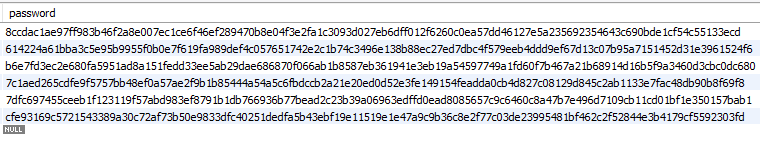

# 💬 OST
#### 🏢 Office messenger Supporting Telecommuting
<br><br>

# 개발 기간
##### 3학년 1학기 응용소프트웨어실습 (2021-03-12 ~ 2021-06-11)
카카오톡을 모티브로 `C#` 과 `MySQL` 등을 사용해 만든 **사내 채팅 프로그램** 팀프로젝트 입니다.

실행하기 위해서는 몇가지 설정이 필요합니다.
<br><br>

# 데이터 베이스 및 유저 생성
서버 프로그램을 돌리기 위해 `.Net Core` 와 `MySQL` 프로그램이 설치될 수 있는 `Ubuntu 20.04 LTS` 운영체제에서 우선 `MySQL` 을 설치하고 `DB` 및 `User` 를 생성합니다.
##### bash
``` bash
sudo mysql -u root -p
```
##### sql
``` sql
CREATE DATABASE ost DEFAULT CHARACTER SET utf8mb4 COLLATE utf8mb4_general_ci;
CREATE USER ost@localhost identified BY 'dr@M@0st';
GRANT ALL PRIVILEGES ON ost.* TO ost@localhost;
FLUSH PRIVILEGES;
```
<br><br>

# 테이블 생성
##### sql
``` sql
CREATE TABLE `ost`.`employee` (
  `id` INT NOT NULL,
  `password` VARCHAR(64) NOT NULL,
  `name` VARCHAR(20) NOT NULL,
  `phone` VARCHAR(14) NULL,
  `central` VARCHAR(45) NOT NULL,
  `team` VARCHAR(45) NOT NULL,
  `rank` VARCHAR(45) NOT NULL,
  `profile` LONGBLOB NULL,
  `profile_length` INT UNSIGNED NULL,
  PRIMARY KEY (`id`));

CREATE TABLE `ost`.`schedule` (
  `author` INT NOT NULL,
  `title` VARCHAR(45) NULL,
  `start` DATETIME NOT NULL,
  `end` DATETIME NOT NULL,
  `scope` VARCHAR(45) NULL,
  `contents` LONGTEXT NULL,
  `target` VARCHAR(45) NULL,
  CONSTRAINT `schedule_id`
    FOREIGN KEY (`author`)
    REFERENCES `ost`.`employee` (`id`)
    ON DELETE NO ACTION
    ON UPDATE NO ACTION);

CREATE TABLE `ost`.`room` (
  `id` VARCHAR(32) NOT NULL,
  `scope` INT NULL,
  `target` VARCHAR(45) NULL,
  PRIMARY KEY (`id`));

CREATE TABLE `ost`.`chat` (
  `room_id` VARCHAR(32) NOT NULL,
  `chat_date` DATETIME(6) NOT NULL,
  `employee_id` INT NOT NULL,
  `data` LONGBLOB NULL,
  `data_length` INT NULL,
  `data_type` INT NULL,
  UNIQUE INDEX `chat_date_UNIQUE` (`chat_date` ASC) VISIBLE,
  INDEX `chat_room_id_idx` (`room_id` ASC) VISIBLE,
  INDEX `chat_date_idx` (`chat_date` ASC) VISIBLE,
  INDEX `chat_employee_id_idx` (`employee_id` ASC) VISIBLE,
  CONSTRAINT `chat_room_id`
    FOREIGN KEY (`room_id`)
    REFERENCES `ost`.`room` (`id`)
    ON DELETE NO ACTION
    ON UPDATE NO ACTION,
  CONSTRAINT `chat_employee_id`
    FOREIGN KEY (`employee_id`)
    REFERENCES `ost`.`employee` (`id`)
    ON DELETE NO ACTION
    ON UPDATE NO ACTION);
```

이로써 사전 세팅이 모두 끝났습니다.
<br><br>

# 서버 실행
`Release` 탭에서 `OSTServer.zip` 을 다운받고 압축을 풀어주세요.

> #### 잠깐!
> 서버는 `.Net Core 3.1` 를 사용하며 실행하는 곳에 설치가 되어 있어야합니다.
또한 `MySQL` 또는 `MariaDB`가 설치되어 있어야하며 데이터 베이스는 `127.0.0.1` 로 접속하기 때문에 로컬에 설치되어 있어야합니다. (프로젝트 `Server/Classes/Database.cs` 에서 변경 가능)
#### Linux (Bash)
``` bash
dotnet [server-ip] [server-port]
```
#### Window (Powershell)
``` powershell
.\OSTServer.exe [port]
```
> `OSTServer.exe` 를 그냥 실행해도 되지만 포트는 기본값인 `6756` 으로만 실행됩니다.

#### 실행 결과
``` powershell
PS C:\Users\chchc\Downloads\OSTServer> .\OSTServer.exe
[2021-07-14 13:40:19] DB | Server 127.0.0.1 is connected
[2021-07-14 13:40:19] System | Server is opend with port 6756
```
<br><br>

# 프로그램 실행
`.Net Framework 4.7.2` 기반이며 `Window Forms` 로 제작되어 윈도우에서만 실행하시길 바랍니다.
리눅스와 같은 운영체제에서 실행가능한 방법도 있으나 여기서 다루진 않겠습니다.
#### Window (Powershell)
``` powershell
.\OfficeMessengarST.exe [server-ip] [server-port]
```
> `OfficeMessengarST.exe` 를 그냥 실행해도 되지만 기본값인 `127.0.0.1:6756` 으로만 실행됩니다.

<br><br>

# 소개
이제부터 프로그램 기능을 파해쳐 보도록 하겠습니다.

#### 접속

<br>

#### 사원 등록

<br>

#### 로그인 및 메인 화면

<br>

#### 조직도 및 사원 정보

<br>

#### 1:1 채팅

<br>

#### 팀 채팅

<br>

#### 본부 채팅

<br>

#### 회사 전체 채팅

<br>

#### ER Diagram

<br>

#### Table: Employee

<br>

#### Table: Room
`target` 컬럼이 제1정규화도 만족하지 못한다는 점이 아쉽긴 합니다.

<br>

#### Table: Chat
채팅 테이블의 `key` 를 지정하기 위해 `chat_date` 컬럼을 `DATETIME(6)` 으로 지정하여 `millisecond` 까지 저장하도록 하였습니다.

<br>


<br><br>

# 특징
#### 채팅 화면 간소화
카카오톡 처럼 같은사람, 같은 시간(분 단위 까지) 일 경우 채팅이 연결되도록 되어있습니다.


<br>

#### 비밀번호 일방향 암호화 저장
데이터베이스에 사원 정보가 저장될 때 비밀번호를 `SHA-512` 암호화 알고리즘을 적용하여 저장하여 보안을 한 층 더 강화하였습니다.


<br>